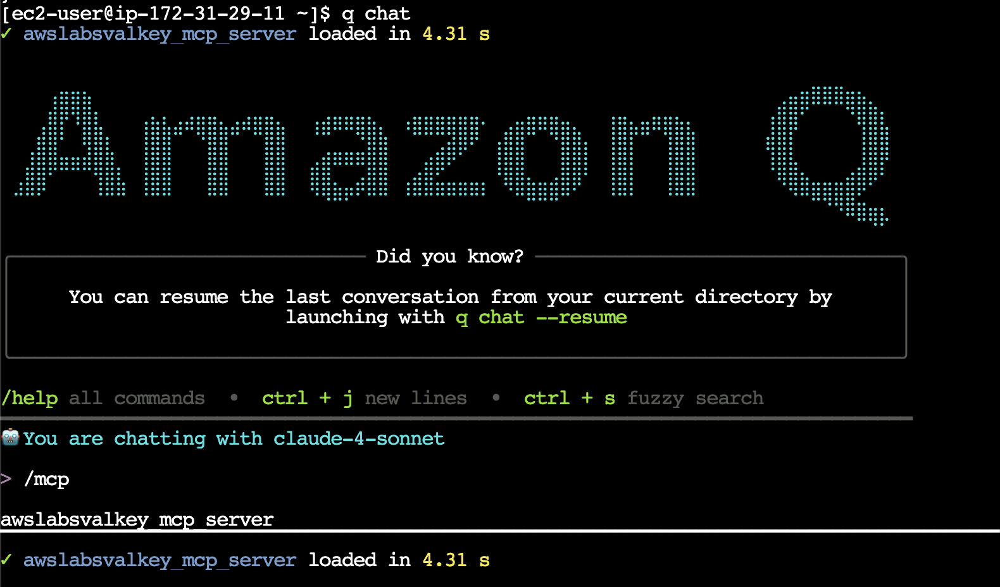

## 3. Valkey MCP 서버 활용해보기

Amazon Q Dev Cli 에서 나간 후 터미널 환경에서 작업을 진행합니다.
```
/quit
```

MCP를 사용하기 위한 uv/uvx 패키지를 설치합니다.
```bash
curl -LsSf https://astral.sh/uv/install.sh | sh
```

Amazon Q dev CLI와 Valkey MCP서버 연동을 위해 설정 파일을 생성합니다.
```bash
cat << EOF >> .aws/amazonq/mcp.json
{
  "mcpServers": {
    "awslabs.valkey-mcp-server": {
      "command": "uvx",
      "args": [
        "awslabs.valkey-mcp-server@latest"
      ],
      "env": {
        "VALKEY_HOST": $(aws elasticache describe-replication-groups --replication-group-id test-valkey-cluster --query ReplicationGroups[0].ConfigurationEndpoint.Address),
        "VALKEY_PORT": "6379",
        "VALKEY_USE_SSL": "False",
        "VALKEY_CLUSTER_MODE": "True",
        "FASTMCP_LOG_LEVEL": "ERROR"
      },
      "autoApprove": [],
      "disabled": false
    }
  }
}
EOF
```

Amazon Q dev CLI에 다시 접근합니다.
```
q chat
```



Amazon Q dev CLI 내부에서 요청을 진행합니다.
```
내가 요청하는 모든 질문에 한글로 답변해줘. 기술명이나 용어가 영문이 더 자연스러운 경우에만 영문으로 작성해줘.
```

valkey MCP서버를 통해 클러스터 내부 데이터 접근이 가능하도록 인스턴스와 연결 설정을 진행합니다.
```
test-valkey-cluster Elasticache valkey 클러스터와 지금 노드가 연결되도록. 보안 그룹 등 네트워크 작업을 진행해줘.
```

앞으로의 valkey 클러스터 연결 요청은 bash나 python을 사용하는 것이 아닌 valkey-mcp를 사용하도록 명시합니다.
```
앞으로 valkey 클러스터에 연결할 때는 valkey mcp를 이용해서 통신해줘
```

현재 valkey 클러스터에 연결된 client정보와 현 memory 사용량 분석을 요청합니다.
```
test-valkey-cluster 클러스터에 현재 연결된 client 정보와 memory 정보를 정리해줘
```

실습 진행한 리소스 삭제를 요청합니다.
* 삭제의 경우 오동작 방지를 위해 리젼 정보와 클러스터 정보를 명확히 제시합니다.

```
us-east-1 리젼에 있는 ElastiCache valkey 클러스터 'test-valkey-cluster'를 삭제해줘
```
